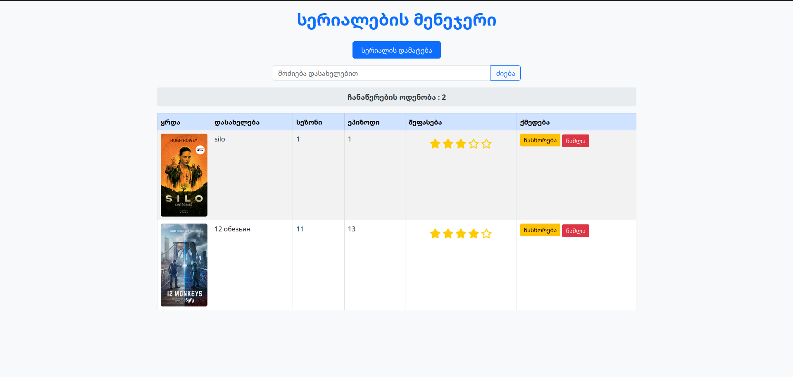

# Portable SerialTree - მარტივი სერიალების მენეჯმენტი

Portable SerialTree არის მსუბუქი და მოსახერხებელი ვებ აპლიკაცია, რომელიც საშუალებას გაძლევთ მართოთ თქვენი საყვარელი სერიალები. აპლიკაცია მუშაობს Windows, Linux და Termux გარემოში.

## მახასიათებლები

-   მარტივი და ინტუიციური ინტერფეისი
-   სერიალების დამატება, რედაქტირება და წაშლა
-   მონაცემების შენახვა ადგილობრივ მონაცემთა ბაზაში (`series.db`)
-   მხარდაჭერა Windows, Linux და Termux-ზე
-   მსუბუქი და სწრაფი მუშაობა

## ინსტალაცია და გაშვება

### Windows / Linux / Termux

```bash
# კოდის გადმოწერა
git clone https://github.com/georgiaithelpers/Portable_SerialTree.git
cd Portable_SerialTree

```

## **მნიშვნელოვანი შენიშვნა**

⚠️ **არ დაკარგოთ ****************************************************************************************`series.db`**************************************************************************************** ფაილი!** ეს ფაილი შეიცავს ყველა მონაცემს თქვენი სერიალების შესახებ. მისი წაშლის ან დაზიანების შემთხვევაში, ინფორმაცია აღდგენა შეუძლებელი იქნება.

## გამოყენება

გაშვების შემდეგ, გახსენით ბრაუზერი და გადადით მისამართზე (აპლიკაციის მისამართი დამოკიდებულია იმაზე, თუ რას გადასცემთ სერვერს host-ად):

```
http://127.0.0.1:5000

```


